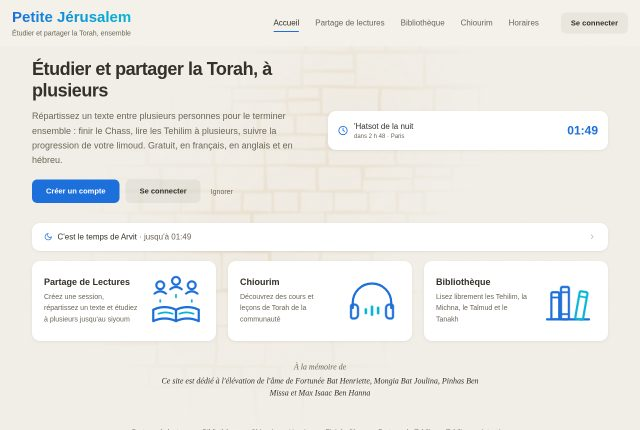
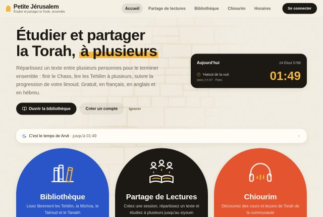
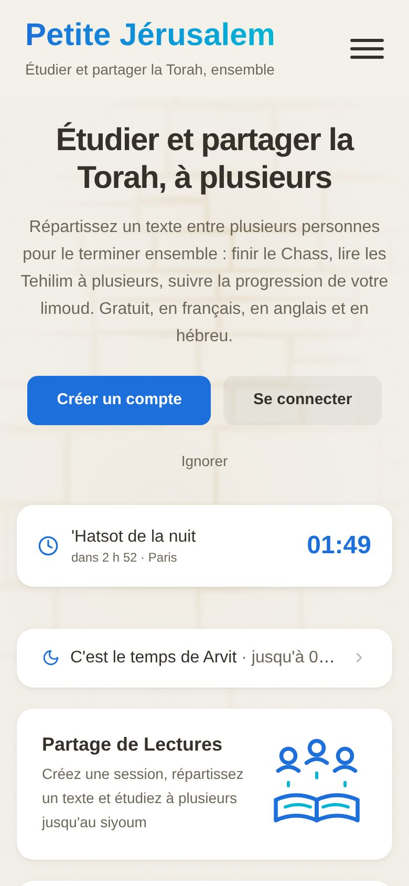
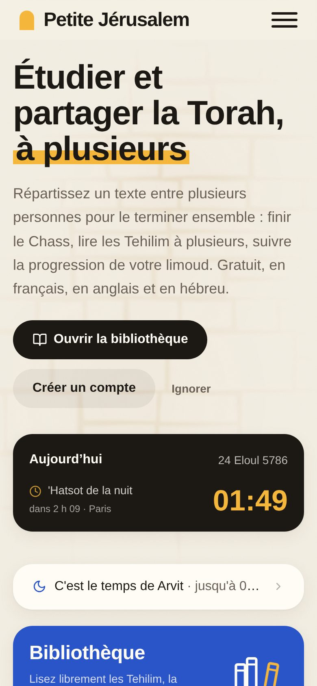
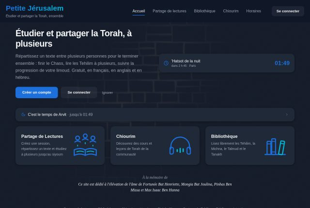
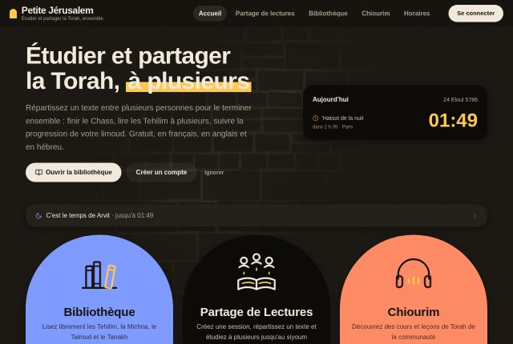
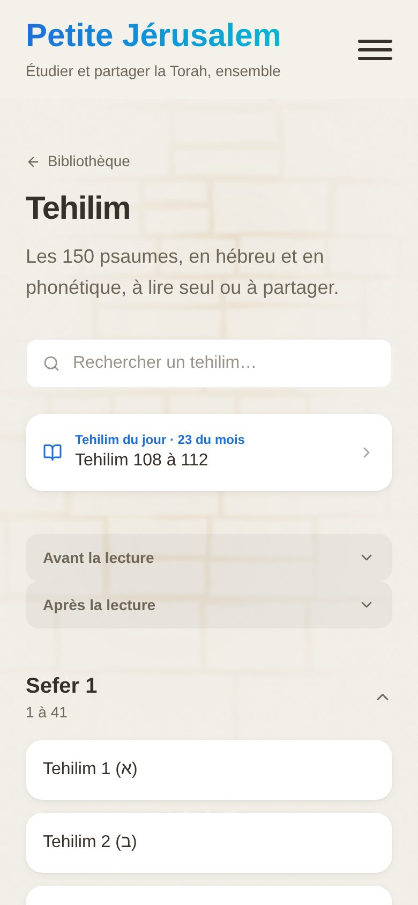
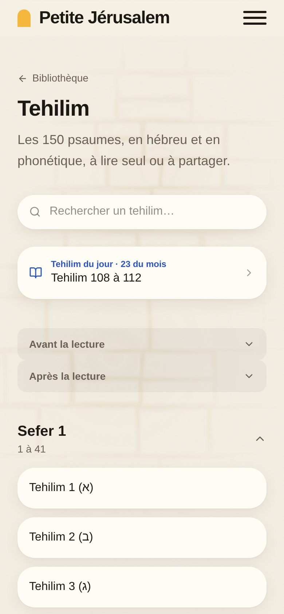
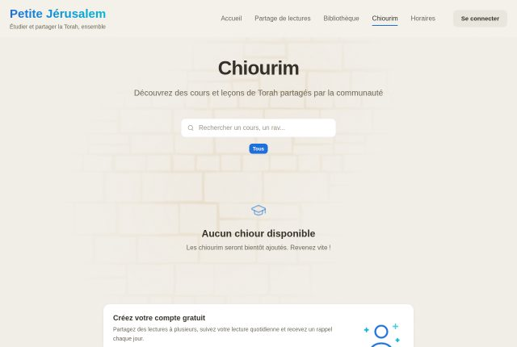
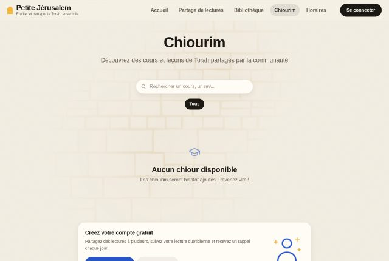

# Rafraîchir l'interface sans qu'elle ait l'air générée

Septembre 2026. Proposition de mise à jour de l'interface et de l'expérience,
dans l'idée graphique qui est déjà celle du site (la pierre de Jérusalem, le
beige, le mur en lumière derrière la page, l'étagère de sefarim), avec un
objectif de plus : que le rendu ne fasse pas « fait par une IA ». La première
moitié de ce document dit ce qui donne cette impression et pourquoi le site
y prêtait le flanc ; la seconde dit ce qui a été fait sur cette branche et
ce qui reste à faire.

## 1. Ce qui fait « généré par IA », d'après ce qui s'écrit dessus

Le sujet a beaucoup été documenté en 2025 et 2026, par des designers qui
relisent des interfaces produites par des outils de génération de code. Les
mêmes signes reviennent dans toutes les listes, parce que ces outils tirent
tous du même corpus et rendent tous la même « moyenne » :

| Signe | Pourquoi ça trahit |
| --- | --- |
| Inter partout (ou une police par défaut) | Personne ne l'a choisie : c'est ce que l'outil met quand on ne dit rien. Premier signe cité, dans toutes les sources. |
| Texte en dégradé (`bg-clip-text`), dégradé bleu-violet, boutons bleu Tailwind | Le « premium » par réflexe. Le dégradé de deux couleurs voisines dit qu'aucune couleur n'a été choisie. |
| Le gabarit « titre centré, trois cartes jumelles, un bouton » | Le plan par défaut d'une page d'accueil, reconnu au premier coup d'œil. |
| `rounded-2xl` et une ombre sur chaque surface, verre dépoli par réflexe | Tout est rond et flottant, rien n'est hiérarchisé. |
| Icônes de bibliothèque dans des carrés arrondis pastel, une par carte | La même vignette répétée pour chaque fonctionnalité. |
| Petites capitales espacées au-dessus de chaque titre | Le « label » de maquette, posé partout sans raison. |
| Le même `fade-in-up` sur chaque élément, ou aucun mouvement | Un mouvement sans intention ; ou l'inverse, des survols qui ne font rien. |
| Espacements identiques partout (`p-6`, `gap-4`) | Aucun rythme : la page ne respire pas, elle est tramée. |
| Mode sombre gris-bleu de série (`gray-900`) | Le sombre de Tailwind, pas celui du site. |
| Emoji dans l'interface, verbes creux dans les textes | Du remplissage. |

Les sources consultées, pour qui veut aller plus loin : le dépôt
[avoid-ai-design](https://github.com/funboy322/avoid-ai-design) (un audit
de ces motifs, avec ses règles), l'article « AI Design Slop: Why Every
AI-Built Interface Looks the Same » ([Medium, août
2026](https://mohitphogat.medium.com/ai-design-slop-why-every-ai-built-interface-looks-the-same-and-how-to-fix-it-bf874e0b470c)),
« Why Your AI Keeps Building the Same Purple Gradient Website »
([prg.sh](https://prg.sh/ramblings/Why-Your-AI-Keeps-Building-the-Same-Purple-Gradient-Website)),
« 7 Signs a UI Has Been Vibe Coded » ([The Fountain
Institute](https://www.thefountaininstitute.com/blog/signs-vibe-coded-ui)),
« AI Design Slop: 16 Patterns That Out Your App as Vibe-Coded »
([Developers
Digest](https://www.developersdigest.tech/blog/ai-design-slop-and-how-to-spot-it)),
et « Your AI-Built Websites Look Identical to Everyone Else's »
([Medium](https://medium.com/@chiragthummar16/your-ai-built-websites-look-identical-to-everyone-elses-these-10-skills-fix-that-046ddf58e4d5)).
La règle qui les résume toutes : chaque réflexe remplacé par un choix.

## 2. Où le site en était

Ce que le site avait déjà de bien, et qu'il faut garder : le beige et le mur
de pierre en lumière (StoneWallBackground, unique en son genre), l'étagère de
livres reliés de la bibliothèque, les illustrations dessinées à la main de
l'accueil, Frank Ruhl Libre pour l'hébreu, des cartes sans bordure, des
ombres teintées de chaud, des puces discrètes. C'est l'idée graphique, on ne
la touche pas.

Ce qui, en revanche, cochait les cases du tableau ci-dessus :

- Inter comme police d'interface, pour tout, titres compris.
- Le nom du site en dégradé bleu vers cyan (`bg-clip-text`), le prénom de
  l'accueil aussi, le bandeau du profil en dégradé plein.
- Le thème « Océan » : un bleu et un cyan voisins, de la palette Tailwind.
- Trois cartes jumelles sous le titre de l'accueil, chacune avec son
  illustration, chacune montée par le même `fade-in-up` décalé ; le titre
  centré sur téléphone.
- Toutes les surfaces à 16 px de rayon avec la même ombre, les boutons et
  les champs à 10 px, les filtres en pastilles pleines.
- Des étiquettes en capitales espacées (« SEFER 1 », « SÉRIE », « AUBE ET
  LEVER ») en tête de pages et de sections.
- Un mode sombre `gray-900` bleuté, étranger à la pierre.
- Un emoji dans le pied de page, un halo coloré sous le bouton rond de la
  barre basse.

## 3. La direction : Midi à Jérusalem

Une image pour tenir le tout : la vieille ville à midi. La pierre est
blonde, la lumière est franche, et sur la pierre il y a des aplats de
couleur qui claquent : le bleu du tekhelet, le rouge de la grenade, le vert
de l'olivier, et le soleil, jaune, partout. Les portes sont en arche. On
écrit gros, en gras, sans capitales.

### Les quatre signes de la maison

Ce qui fait qu'on reconnaît le site en une seconde, et que personne d'autre
n'a :

1. **L'arche.** Un plein cintre sur un bas droit (`.arch`). C'est la forme
   des trois tuiles de l'accueil, du signe posé devant le nom du site, de
   l'onglet courant dans la barre basse de l'app et du bouton rond des
   horaires. Elle vient des portes de la vieille ville, pas d'un
   catalogue de composants.
2. **Le surligneur au soleil.** Un mot du titre pris dans un trait jaune,
   comme au marqueur (`.hl`) : « à plusieurs » sur l'accueil, le prénom sur
   le tableau de bord et en tête du profil. C'est le seul ornement des
   titres ; il dit où regarder.
3. **Les tuiles.** De grands aplats de couleur pleine avec du texte clair
   dessus (`.tile`), plutôt que des cartes blanches jumelles : la
   bibliothèque dans la couleur dominante, le partage à l'encre, les
   chiourim dans la couleur qui répond. La tuile d'encre du jour, sur
   l'accueil, porte l'heure en très grand dans la couleur du soleil.
4. **Les titres en Bricolage Grotesque.** Une grotesque qui a du caractère
   aux grands corps (l'axe optique se règle tout seul), en 800, serrée,
   sans capitales. Elle n'est pas dans les listes de polices « de
   réflexe », et elle ne ressemble pas à Inter.

### Les choix, un par un

**Typographie.** Trois voix, chacune à sa place :

- **Bricolage Grotesque** pour les titres (`--font-display`, h1 à h3) et le
  nom du site. Fixe : c'est la marque, elle ne se choisit pas.
- **Atkinson Hyperlegible Next** pour l'interface (`--font-sans`), à la
  place d'Inter. Dessinée pour être lue vite et par tout le monde, avec des
  lettres qu'on reconnaît (le zéro barré, le « l » à pied) ; elle est
  chaleureuse sans être ronde. Elle reste au choix, avec Lora et Nunito.
- **Frank Ruhl Libre** pour l'hébreu, inchangée.

**Couleurs.** Chaque thème garde son identifiant (les comptes l'ont gardé)
mais devient un trio franc : une dominante, une couleur qui lui répond, et
le soleil, commun à tous.

| Thème | Dominante (`--color-primary`) | Réponse (`--color-tertiary`) | Soleil (`--color-sun`) |
| --- | --- | --- | --- |
| Océan (tekhelet) | cobalt `#2A55C9` | grenade `#E4542F` | `#F4B63B` |
| Coucher de soleil (grenade) | grenade `#E4542F` | cobalt `#2A55C9` | `#F4B63B` |
| Émeraude (olivier) | vert `#1F8A5B` | grenade `#E4542F` | `#F4B63B` |

Chaque thème a sa version pour le fond sombre, plus claire, que `useTheme`
repose à chaque bascule d'apparence. `--color-secondary`, le nom
historique de l'accent (illustrations, puces), vaut désormais le soleil.
Pas de dégradé nulle part : une couleur en aplat, ou rien. Le beige de la
pierre est un peu plus chaud qu'avant (`#f4efe4`), l'encre est un
brun-noir profond (`#1c1814`) qui tient tête aux aplats.

**Surfaces.** Sans aucun liseré. Une carte, c'est du papier crème
(`#fffcf5`) posé sur la pierre par une ombre chaude et douce, qui se
creuse au survol pendant que la carte se soulève de deux pixels. Rayon de
24 px sur les cartes, pilules sur tout ce qui se touche (boutons, champs,
puces, filtres, onglets du bandeau).

**Mode sombre.** Une nuit chaude (`#17140f`), les tuiles de couleur en
version claire avec du texte d'encre dessus, la tuile d'encre plus noire
que la nuit. La barre système de l'app, les aperçus des réglages et
l'introduction suivent.

**Mouvement.** Deux moments, pas plus : les illustrations s'animent au
survol de leur tuile (c'est le dessin qui bouge, jamais la boîte qui
grossit), et les cartes se soulèvent au survol. L'entrée décalée de tous
les éléments de l'accueil a disparu.

### L'expérience, ce qui change

- **L'accueil dit d'abord ce qu'on peut faire tout de suite.** Le premier
  bouton ouvre la bibliothèque, qui ne demande pas de compte ; créer un
  compte vient en second, et « Ignorer » le retire pour de bon. Avant, le
  seul chemin proposé était de créer un compte.
- **Le jour, en un regard.** La tuile d'encre donne la date hébraïque (le
  jour suivant dès la sortie du soleil), le prochain horaire, le compte à
  rebours et le lieu. Sur le tableau de bord d'un compte, elle est à côté
  de la lecture du jour.
- **Les trois rubriques sont reconnaissables de loin**, chacune à sa
  couleur, la bibliothèque en premier : c'est ce qu'on vient faire le plus
  souvent. Sur téléphone, elles s'empilent en bandeaux ; sur grand écran,
  ce sont trois arches.
- **Le bandeau du site** montre la page courante par une pilule, et
  l'entrée « Se connecter » est un vrai bouton d'encre, pas un lien gris.
- **La barre basse de l'app** pose l'icône de l'onglet courant dans une
  petite arche au soleil : l'onglet actif se voit sans lire.
- **Les filtres** (catégories de chiourim, mes sessions, types de textes)
  sont des pilules, celle qui est retenue à l'encre ; les étiquettes de
  tête (« Sefer 1 », « Cette semaine ») sont des pilules au soleil.
- **Le profil** ouvre sur le nom, en grand, surligné : plus de bandeau
  en dégradé qui ne disait rien.

## 4. Avant, après

Captures prises sur le serveur de dev, en visiteur (sans compte), le même
jour, sur `main` puis sur cette branche.

| Avant | Après |
| --- | --- |
|  |  |
|  |  |
|  |  |
|  |  |
|  |  |

## 5. Ce que cette branche change, fichier par fichier

- `src/assets/main.css` : les jetons (couleurs, trio de thème, polices,
  rayons, ombres), le sombre chaud, les composants partagés (`.card` sans
  liseré, `.btn` en pilule, `.btn-ink`, `.chip`, `.field`, `.eyebrow`,
  `.filter-tab`, `.hl`) et les utilitaires `tile`, `tile-ink`, `arch`.
- `index.html` : Atkinson Hyperlegible Next, Bricolage Grotesque et Frank
  Ruhl Libre en polices par défaut, `theme-color` sur le nouveau beige.
- `src/composables/useTheme.ts` : le trio de couleurs par thème, sa
  version sombre, reposée quand l'apparence bascule.
- `src/composables/useFonts.ts` et les trois fichiers de langue : Atkinson
  remplace Inter dans les choix.
- `src/composables/useColorScheme.ts`, `useNativeStatusBar.ts`, `App.vue`,
  l'introduction et ses maquettes : les fonds clair et sombre.
- `src/views/HomeView.vue` : le titre surligné, le bouton vers la
  bibliothèque, les tuiles en arche, plus d'animation d'entrée.
- `src/components/ZmanimCard.vue` : la tuile d'encre du jour, avec la date
  hébraïque.
- `src/components/NavbarComponents.vue` : le signe en arche, le nom en
  titrage, les liens en pilule, le bouton de connexion à l'encre.
- `src/components/BottomTabBar.vue` : l'onglet courant dans une arche au
  soleil, le bouton rond en arche.
- `src/views/profilePage/ProfileHeader.vue`, `ProfilePage.vue` : plus de
  dégradé, le nom surligné.
- Les pages qui portaient des étiquettes en capitales (lecture, paracha,
  série, studio, profil, horaires, introduction) : `.eyebrow`.
- `ChiourimPage.vue`, `ShareHomePage.vue` : `.filter-tab`.
- `SiteFooter.vue` : sans emoji.
- Les titres h1 et h2 perdent `tracking-tight` : la police de titrage
  porte déjà son propre serrage.

Vérifié : `npm run verify` (type-check, lint, tests) passe, et les huit
pages principales ont été relues en clair et en sombre, sur téléphone et
sur grand écran.

## 6. Ce qui reste à faire, par ordre d'intérêt

1. **Les listes de textes** (Tehilim, Michna…) : encore une carte par
   texte, en colonne sur téléphone. Des lignes à filet dans une seule
   carte, ou des pilules en grille, feraient tenir un sefer sur un écran.
2. **La frise « Comment ça marche »** du partage : quatre ronds à icône
   reliés par un trait, le motif le plus « catalogue » qui reste. Quatre
   arches numérotées, dans les couleurs du thème, feraient l'affaire.
3. **Les en-têtes de page** (partage, chiourim) sont encore centrés ; les
   passer à gauche avec le surligneur, comme l'accueil, unifierait le site.
4. **Les fondus de bloc** (`animate-[fadeIn…]`, une cinquantaine de blocs)
   : à réserver au changement de page, ou à retirer.
5. **Le lecteur audio et le bouton rond de lecture**, à reprendre dans le
   même esprit (pilules, encre, soleil).
6. **Les captures des fiches store**, à refaire une fois la direction
   validée.
7. **Un compte qui avait choisi Inter** retombe sur Atkinson : à dire dans
   les notes de version, ou à ignorer.
